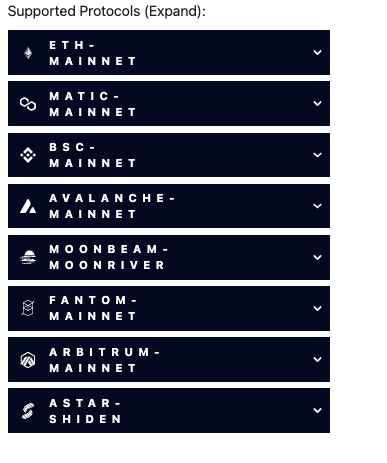

## 2022-1-31

### ADDED

- Added supported protocols annotation to NFT market endpoints. Added a supported protocols annotation to CovalentOpenAPI and an array of protocols for the two NFT market endpoints. 

### UPDATED

- Updated Moonbeam Stablecoins, adding the data to it’s AMM pricing service. This newly updated list of stable coins added to the AMM pricing service, which already exist on Moonbeam ensures that the stablecoin routing functions can resolve prices for the AMM pricing service.
- Moonbeam, `chainID = 1284` has been updated to include two DEXes: StellaSwap and BeamSwap. Developers can query ALL Class A endpoints to retrieve the necessary data from the supported DEXes. 
- The Class B AAave endpoint has been updated to display supply positions with Borrows. This is achieved via the AaveV2Service. Example query: `https://api.covalenthq.com/v1/1/address/0xd9976b0627ca845ed639bbb3850da958c20485f9/stacks/aave_v2/balances/`
- NFT market cap improvements, filled in missing contract names, added more market support and chain support. 
- The Token balances endpoint has been updated to return Ronin/Axie chain (`ChainID = 2020`) Gas currency and Ronin/Axie coinGecko prices.
- Updated Pricing service_v2. Pricing service_v1 deprecated.

### BUG FIXES

- Fixed Pancakeswap null check - 500 for missing ticker symbol [Issue-1379](https://github.com/covalenthq/scout/issues/1379)
- Fixed duplicate gas wallet balance items, fixes Balances Timeout on Ronin/Axie [Issue-1345](https://github.com/covalenthq/scout/issues/1345)
