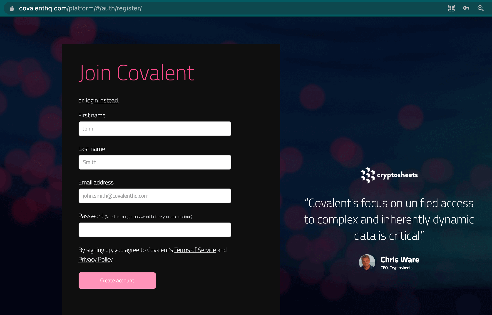

# Frequently Asked Questions
These questions serve as a self serve resource for using the [Covalent API](https://www.covalenthq.com/docs/api/) and provide additional informational required to query the Covalent API.

&nbsp;
## How do I get an API KEY?
Visit https://www.covalenthq.com/platform/#/auth/register/ and fill the form.

Your `API_KEY` will be available on the dashboard.

&nbsp;
## How do I query an endpoint?
The url patterns consist of an api host plus the endpoint path plus your API KEY. The api host URL is: https://api.covalenthq.com/v1/ and all endpoints are called using GET requests. An example endpoint path for getting token balances is `/v1/{chain_id}/address/{address}/balances_v2/`.

Request URL = api path + endpoint path + API_KEY

https://api.covalenthq.com/v1/{chain_id}/address/{address}/balances_v2/
Note - the `/v1/` is NOT repeated

Example URL: https://api.covalenthq.com/v1/1/address/0xAb5801a7D398351b8bE11C439e05C5B3259aeC9B/balances_v2/?&key=”API_KEY”

Your API KEY starts with `ckey`.

&nbsp;
## What are Chain IDs and how do I set this parameter on a request?
Chain Ids are the unique integer ID of an EVM supported blockchain network. A global list of EVM network Chain Ids can be found here: https://chainlist.org/ 
Covalent network documentation can be found here: https://www.covalenthq.com/docs/api/#overview--supported-networks.

To set a Chain Id on an API request, simply change the `{chain_id}` query parameter to the value mentioned in the list of supported networks.

&nbsp;
## Are there any API use limits?
- Users can make 20 concurrent API calls using a single API key.
- For decoded log events and other endpoints where you are asked to specify a block range, you are limited to a million block range after which point you need to make a follow up call using the pagination info.

To inquire about possibily adjusting any API use limits, please contact partnerships@covalenthq.com. 

&nbsp;
## I only get back 100 items (or rows) of data when I expected a lot more.
By default, the API returns 100 items in a single page. To get all the data, simply include the `page-size` parameter with a large value in your request.

&nbsp;
## What are the common error messages and what do they mean?
**404 Page unavailable** - The server cannot find the requested API resource. Check your request endpoint.

**500: Request Timeout** - This error response is given when the query will take longer than approximately 90 seconds.

**503: Network Error** - The server cannot handle the request at the time, which might be due to a high number of concurrent requests or if a server is momentarily down. Retry your request in a couple minutes or reduce the number of concurrent requests.  

&nbsp;
## How do I get and export data in CSV format?
If making a request via `curl`, just add `&format=csv` to the endpoint. 
Example: https://api.covalenthq.com/v1/1/address/0xAb5801a7D398351b8bE11C439e05C5B3259aeC9B/balances_v2/?&key=”Your-API_KEY”&format=csv

When using the API docs, put `csv` in the `format` input field. 

&nbsp;
## How do I contact Developer Support when I’m stuck?
We have API support staff available on [Discord](https://covalenthq.com/discord). Please ask all questions in the `#feedback-and-support` channel.

&nbsp;
## How can I partner with Covalent on my project?
We are delighted to hear that you are considering partnering with us! Kindly send an email to media@covalenthq.com.

&nbsp;
## How do I find more developer support tools provided by Covalent?
Check out https://www.covalenthq.com/docs/tools. These tools are complementary to the Covalent API and provide additional features and functionality to extract and analyze complex blockchain data.

