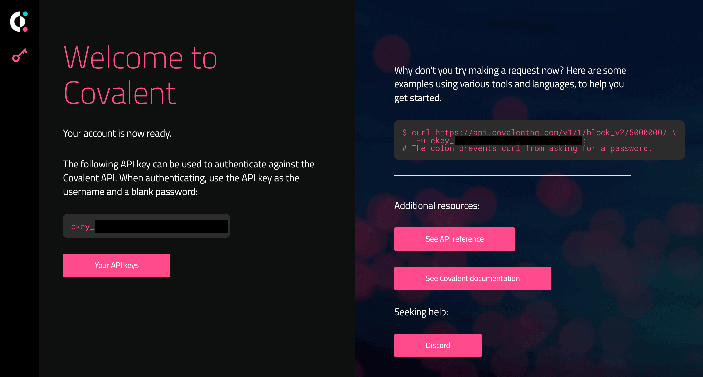

# Developer Frequently Asked Questions
These questions serve as a self serve resource for developers using the [Covalent API](https://www.covalenthq.com/docs/api/) and provide additional informational required to query the Covalent API.

&nbsp;
## How do I get an API KEY?
Visit https://www.covalenthq.com/platform/#/auth/register/ and fill the form.

Your `API_KEY` will be available on the dashboard

## How do I query an endpoint?
The url patterns consist of an api host plus the endpoint path plus your API KEY. The api host is at: https://api.covalenthq.com/v1/ all endpoints are called using GET requests. An example endpoint path for getting token balances is /v1/{chain_id}/address/{address}/balances_v2/

To construct an endpoint = api path + endpoint path + API_KEY

https://api.covalenthq.com/v1//{chain_id}/address/{address}/balances_v2/
The `/v1/` is NOT repeated

Example url: https://api.covalenthq.com/v1/1/address/0xAb5801a7D398351b8bE11C439e05C5B3259aeC9B/balances_v2/?&key=”Your-API_KEY”

Your API KEY starts with “ckey_”

## What are ChainIDs and How do I set ChainID on a request?
These are the IDs of the supported Blockchain Networks. A chainID is required to query a particular network as it differentiates between networks. Each network Covalent support has a chainID which can be found here: https://www.covalenthq.com/docs/api/#overview--supported-networks

To set a chainID on a requests, simply change the section in the url `{chain_id}` to the required number from the list of supported networks.

## How do I increase my API limit rate?
- Users can make 20 concurrent API calls using a single API key
- For decoded log events and other endpoints where you are asked to specify a block range, you are limited to a million blocks after which point you need to make a follow up call using the pagination info.

To increase your API calls beyond this rate, kindly send an email to partnerships@covalenthq.com

## What are the common error messages and what do they mean?
**404 Page unavailable** - The server can not find the requested resource. In the browser, this means the URL is not recognized. In an API, this can also mean that the endpoint is valid but the resource itself does not exist.

**500: Request Timeout** - This error response is given when the query will take a much longer than required time to get a response in time.

**503: Network Error** - The server cannot handle the request at the time. Common causes are a server that is down for maintenance. 
Common way to fix: Retry the request. 

## How do I return and export CSV only data?
If making a request via curl, kindly add the `&format=csv` to the endpoint. 
Example: https://api.covalenthq.com/v1/1/address/0xAb5801a7D398351b8bE11C439e05C5B3259aeC9B/balances_v2/?&key=”Your-API_KEY”&format=csv

Via the API docs, simply fill the input field `format` with `csv`

## How do I contact Developer Support when I’m stuck?
We are available on Discord https://covalenthq.com/discord Kindly ask any and all questions in the `#feedback-and-support` channel

## How can I partner with Covalent on my project?
That is delightful to hear that you are considering partnering with us! Kindly send an email to media@covalenthq.com

## How do I find all the tools available on Covalent?
These tools are complementary to the Covalent API and provide additional features and functionality to extract and analyze complex blockchain data. https://www.covalenthq.com/docs/tools

