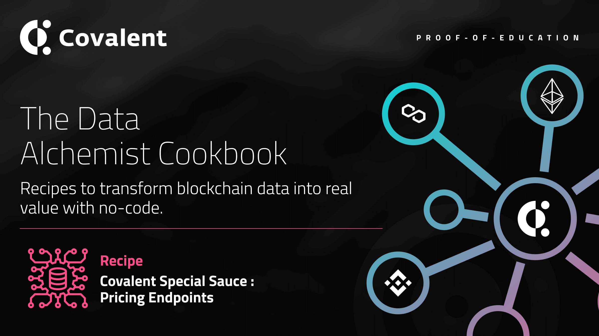

# Pricing Endpoints

<Aside>

**Outcome:** Learn what the _Pricing_ endpoints are and how they can be used to get detailed Smart Contracts and Wallet address data across multiple blockchain networks seamlessly.

</Aside>

&nbsp;

## Introduction

We at Covalent define _Pricing_ endpoints as those that return enriched blockchain data and are applicable to all blockchain networks such as balances, transactions, log events, etc. These endpoints are _generic_ and are available via the same API on all supported blockchains. All the user needs to do is simply change a single parameter - the `chainId`.

<Aside>

Each of the Covalent API Pricing endpoints can _individually_ power entire apps! Each has a unique case that will give an app/user the powers to carry out large queries across different networks.

</Aside>

These endpoints are part of our unique value proposition and, we believe, are not matched by any competitor in the blockchain space.

&nbsp;

### Prerequisites

<Aside>

Using the Covalent API can begin as soon as you create an account, and requires two steps:

1. [Obtain your API key](https://www.covalenthq.com/platform/#/auth/register) so Covalent can authenticate your API requests

2. [Test your API key](https://www.covalenthq.com/docs/api/) directly from our docs to confirm your key is set up correctly

</Aside>

&nbsp;

## Endpoints Summary:

The following are ALL the Pricing endpoints with a description of the enriched blockchain data they return:

<Definitions>

- `/v1/pricing/historical_by_address/{chain_id}/{quote_currency}/{contract_address}/`

  - Get historical prices by **smart contract address**. Returns historical prices for a `contract_address` in a particular chain_Id and quote_currency. You can pass `to` and `from` to define a range in date using the format `YYYY-MM-DD`. By default if the `to`, `from` and `date` are omitted, the query returns today's price.

- `{/v1/pricing/historical_by_addresses/{chain_id}/{quote_currency}/{contract_addresses}/`

  - Get historical prices by **smart contract addresses**. This is a lot like the previous call, but in this case, you can retrieve historical prices for a contract_address, or a comma-separated group of contract_addresses. Also, you can pass `to` and `from` to define a range in date using the format `YYYY-MM-DD`. By default if the `to`, `from` and `date` are omitted, the query returns today's price.

- `/v1/pricing/historical/{quote_currency}/{ticker_symbol}/`

  - Get historical prices for a ticker_symbol in a particular `quote_currency`. You can pass `to` and `from` to define a range in date using the format `YYYY-MM-DD`. By default if the `to`, `from` and `date` are omitted, the query returns today's price.

- `/v1/pricing/tickers/`

  - Get spot prices and metadata for all tickers or a select group of tickers. Without `tickers` query param, it returns a paginated list of all tickers sorted by market cap.

- `/v1/pricing/volatility/`

  - Get price volatility and metadata for a select group of tickers. Without the tickers query param, it defaults to ETH volatility.

</Definitions>

The following tutorials use JavaScript code templates and the Covalent [API docs](https://www.covalenthq.com/docs/api/#overview) to explore several API endpoints and how they can individually power entire apps. The code templates are hosted on [Repl.it](https://repl.it).

## Tutorial

<Definitions>

- [Pricing Endpoints](https://replit.com/@1millionwallets/Template-Pricing-Endpoints#README.md)

  - This tutorial presents a Dashboard which demonstrates the use of ALL Pricing endpoints. Begin by reading the README.md file which explains in detail the use of the Pricing Endpoints.

</Definitions>

