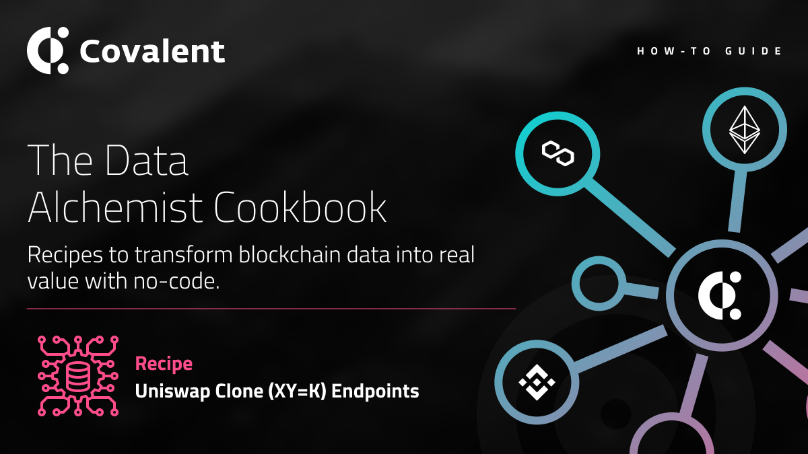

# Uniswap Clone Endpoints
<Aside>

**Outcome:** Learn how a universal set of endpoints can be used to on any supported *Uniswap clone* to fetch swap, volume, liquidity, pool, token and other key metrics for the DEX. 

</Aside>

&nbsp;
## Introduction
We at Covalent have generally built out custom *Class B* endpoints to provide exchange, liquidity, swap and other granular and historical data for large DEXs such as PancakeSwap and SushiSwap, which are clones of the core Uniswap code base. Thus, we revised our approach to build out a set of universal endpoints which can be applied to any supported *Uniswap clone* to fetch swap, volume, liquidity, pool, token and other key metrics. All the user has to do is simply replace the `dexname` in the API calls shown below by the name of a supported Uniswap clone.   

<Aside>

Current supported Uniswap clone `dexname`s include:
* `sushiswap`
* `quickswap`
* `pangolin`
* `spiritswap`
* `spookyswap`

</Aside>

&nbsp;
### Prerequisites

<Aside>

Using the Covalent API can begin as soon as you create an account, and requires two steps:

1. [Obtain your API key](https://www.covalenthq.com/platform/#/auth/register) so Covalent can authenticate your API requests

2. [Test your API key](https://www.covalenthq.com/docs/api/) directly from our docs to confirm your key is set up correctly

</Aside>

&nbsp;
## Endpoints Summary:
The following universal endpoints work with multiple Uniswap clones across multiple networks. Note the use of `xy=k` in the URL to represent the constant product formula used by automated market makers (AMM) such as Uniswap. For more information about how Uniswap works, see [here](https://uniswap.org/docs/v2/protocol-overview/how-uniswap-works/)

<Definitions>

- `https://api.covalenthq.com/v1/{chain_id}/xy=k/{dexname}/health/`
  - Get the health status of the Uniswap clone DEX. Returns the latest sync block.

- `https://api.covalenthq.com/v1/{chain_id}/xy=k/{dexname}/ecosystem/`
  - Get Uniswap clone ecosystem data. Returns total volume and total liquidity chart data over the last 30 days.

- `https://api.covalenthq.com/v1/{chain_id}/xy=k/{dexname}/pools/`
  - Get Uniswap clone pool data.

- `https://api.covalenthq.com/v1/{chain_id}/xy=k/{dexname}/pools/address/{address}/`
  - Get Uniswap clone pool data by address. Includes 7 day and 30 day volume and liquidity chart data.

- `https://api.covalenthq.com/v1/{chain_id}/xy=k/{dexname}/pools/address/{address}/transactions/`
  - Get Uniswap clone pool transactions by address. Returns the latest 20 swap, mint and burn events.

- `https://api.covalenthq.com/v1/{chain_id}/xy=k/{dexname}/tokens/`
  - Get Uniswap clone token data.

- `https://api.covalenthq.com/v1/{chain_id}/xy=k/{dexname}/tokens/address/{address}/`
  - Get Uniswap clone pool data by address. Includes 7 day and 30 day volume, liquidity and pricing chart data.

- `https://api.covalenthq.com/v1/{chain_id}/xy=k/{dexname}/tokens/address/{address}/transactions/`
  - Get Uniswap clone pool token transactions by address. Returns the latest 20 swap, mint and burn events.

- `https://api.covalenthq.com/v1/{chain_id}/xy=k/{dexname}/address/{address}/balances/`
  - Get Uniswap clone address exchange balances. Returns the LP balances of the address.

- `https://api.covalenthq.com/v1/{chain_id}/xy=k/{dexname}/address/{address}/transactions/`
  - Get Uniswap clone address exchange liquidity transactions.

</Definitions>

