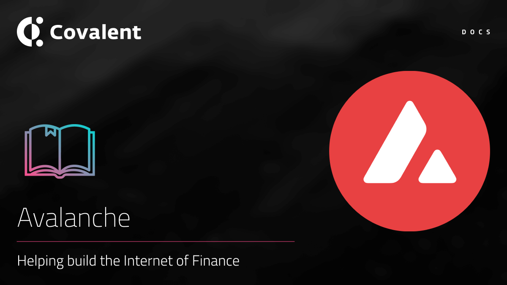

# Avalanche Network

## Introduction

[Avalanche](https://docs.avax.network/) is an open-source platform for launching decentralized applications and enterprise blockchain deployments in one interoperable, highly scalable ecosystem. Avalanche is the first smart contracts platform that processes 4,500+ transactions/second and instantly confirms transactions. Ethereum developers can quickly build on Avalanche as Solidity works out-of-the-box.

A key difference between Avalanche and other decentralized networks is the consensus protocol. Over time, people have come to a false understanding that blockchains have to be slow and not scalable. The Avalanche protocol employs a novel approach to consensus to achieve its strong safety guarantees, quick finality, and high-throughput, without compromising decentralization.

### Quick facts

<TableWrap>

|Property|Value|
|---|---|
|Avalanche Mainnet C-Chain chainId|`43114`|
|Fuji Testnet C-Chain chainId|`43113`|
|Avalanche C-Chain Blockchain Explorer|https://cchain.explorer.avax.network/|
|Block time|~3 seconds|

</TableWrap>

<!-- ### Quickstart overview video
<YouTube id="qhibXxKANWE"/> -->

## Supported endpoints

<Aside>

All __Class A__ endpoints are supported for the Avalanche mainnet and the Fuji testnet. You can query either network via the unified API by changing the `chainId`.

</Aside>

<Definitions>

- `api.covalenthq.com/v1/{chainId}/address/{address}/balances_v2/` 
  - Get token balances for `address`. Return a list of all ERC20 and NFT token balances including ERC721 and ERC1155 along with their current spot prices.

- `api.covalenthq.com/v1/{chainId}/address/{address}/transactions_v2/` 
  - Retrieve all transactions for `address` including their decoded log events. This endpoint does a deep-crawl of the blockchain to retrieve all kinds of transactions that references the address.

- `api.covalenthq.com/v1/{chainId}/address/{address}/transfers_v2/` 
  - Get ERC20 token transfers for `address` along with historical token prices.

- `api.covalenthq.com/v1/{chainId}/tokens/{contract_address}/token_holders/` 
  - Return a paginated list of token holders `contract_address` as of any historical block height.

- `api.covalenthq.com/v1/{chainId}/events/address/{contract_address}/` 
  - Return a paginated list of decoded log events emitted by a particular smart contract.

- `api.covalenthq.com/v1/{chainId}/events/topics/{topic}/` 
  - Return a paginated list of decoded log events with one or more topic hashes separated by a comma.

</Definitions>

<a target="_blank" class="Button Button-is-docs-primary" href="https://www.covalenthq.com/docs/api/">Go to Covalent's API Reference</a>

--- 

## Appendix

### AVAX Gas token

The AVAX token is the native token of Avalanche. This is similar to Ether in Ethereum. To interact with Avalanche, AVAX tokens are required to pay gas fees. The Covalent API response returns `gas_*` fields in fiat units.

### Token mapping

Covalent maintains an on-chain real-time mapping of token addresses between Ethereum mainnet and the Avalanche C-chain. These addresses are used to reverse-lookup prices on Avalanche and also to return the right token logo urls.

Some example of mapped tokens:

|Token|Ethereum mainnet|Avalanche mainnet|
|---|---|---|
|Uniswap UNI|0x1f9840a85d5aF5bf1D1762F925BDADdC4201F984|0xdF3aCC3460965996FF496Cb9D0CF9E6859545a86|
|AAVE|0x7Fc66500c84A76Ad7e9c93437bFc5Ac33E2DDaE9|0x217446Ce09AA183a9034f4FF20d31b9268427187|

For the current token mapping list, see: https://github.com/ava-labs/bridge-tokens/blob/main/data/eth_token_mapping.csv

### Token prices

For tokens that have a mapping back to Ethereum mainnet, Covalent is able to return the mapped prices.