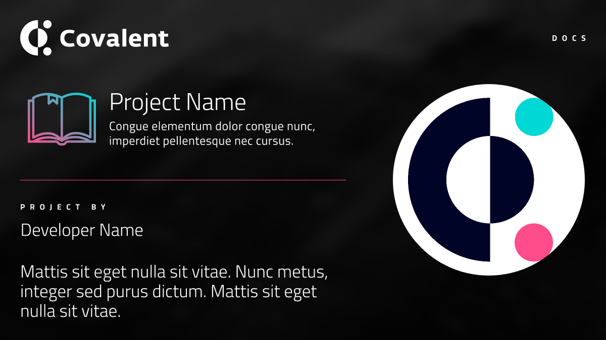

<!---
# You can add upto 4 - 5 tags. Out of which following 2 tags are must
## 1) DeFi/Governance/NFT/Wallet/ {Any new folder requested}
## 2) Independent Projects / Dungeons&Data / OneMillionWallet Hackathons/ ETHGlobal Hackathons/ Alchemists
## 3) Upto 3 custom tags that you want to introduce.
-->


# Project Name
<!---
Title should be in title case:
#Title
-->

 
<!---
Learn how to create banner in Image section below.
-->

**Disclaimer:** The content is created andd submitted by the interested project. Covalent only reviews the standards.

&nbsp;
## Introduction

This section should cover:
- A high level introduction of your project. 
- At what stage is your project and on which networks/blockchains it exists.
- How covalent brought value to you and/or how you will bring value to Covalent's ecoystem.

&nbsp;
## Content 
This section contains the content who want to put emphasis on your project showcase.

&nbsp;
### Minimum Content
- A brief description of how your project utilizes Covalent which must include:
    - Which endpoints are being used and/or planning to use?
    - How Covalent APIs helped you to achieve your project goal?
    - How Covalent align with the future vision of your project? (optional)
- Show working images(max 3) of the infrastructure piece that's being powered by Covalent or a link to a working prototype. Refer [images](#images)
- Link to Github Repos (optional: if open-souced)
- Link to Communication channels. 
---------

&nbsp;
## Docs Standard

There's no need to include this section. This is just for your reference. Delete this when submitting your PR.


&nbsp;
### Bullet Lists

1. Bullets should start with `-` followed by a `space`: `dash` + `space`. For sublists, use a `tab` followed by `dash`

```
- List.
    - Sublist.
```

2. When a bullet list refers to some parameter definitions, use the following structure:

    - `Def` - This is a dummy definitition. You can also use `single quotes to emphasize on something.`

```
Some text here:

 - `Def1` — some text here
 - `Def2` — some text here
```

3. You can use number to describe steps/

```
1. Step 1
2. Step 2
3. Step 3
```

&nbsp;
### Images
There are two different kinds of images needed for showcasing your project:

1. A banner that will be used to feature your project on the index page. 
    - You can create the banner by this [figma template](https://www.figma.com/file/6W6x6WaqxhcZ0QnvVsKsKd/Covalent-Project-Thumbnail-Template?node-id=0%3A1).
    - Add banner in `../images/you-banner.png`. Either `png`, `jpg` or `svg` can be used.
    ```
    covalent-docs
    |--docs
    |--|--content
    |--|--|--project-showase
    |--|--|--|--dao
    |--|--|--|--defi/project-name.md
    |--|--|--|--images/your-banner.png
    |--|--|--|--governance
    |--|--|--|--multichain-analysis
    |--|--|--|--nft
    |--|--|--|--wallet
    |--public
    |--resources/_gen
    |--s
    |--static/static/images
    ...
    ```
    - Use the following structure to bring images in the your markdown file under the [Project Name](#project-name)
    ```
    
    ```
    - Add the image under the category that you chose in [index.md](index.md). For example, if your project falls under [defi](./index.md#defi), then follow this format and paste it below `DeFi`. Don't forget to check if it pointing to the right project.

    ```
    ### [Project Name](/project-showcase/defi/project-name)
    [](/project-showcase/defi/project-name)
    ```

2. Screenshots (max 3) of your working prototype.
    - Create a folder by your `project-name` in `image` directory.
    - Put your screenshots in this folder 
    ```
    covalent-docs
    |--docs
    |--|--content
    |--|--|--project-showase
    |--|--|--|--dao
    |--|--|--|--defi/project-name.md
    |--|--|--|--images/project-name/screenshot-1.png
    |--|--|--|--governance
    |--|--|--|--multichain-analysis
    |--|--|--|--nft
    |--|--|--|--wallet
    |--public
    |--resources/_gen
    |--s
    |--static/static/images
    ...
    ```
    -  Refer the screenshots in the content when you are describing the project. 
    ```
    
    ```

&nbsp;
### Tables

Tables can be used as well and can contain arbitrary Markdown code. As a reference, you can use this online [table generator](https://www.tablesgenerator.com/markdown_tables). To create a table, you can use the following structure:

```
| Table       | Example                     |
| :---------: | :-------------------------: |
| `ONE`       |  Fetch resource  |
| `TWO`       |  Update resource |
| `Three `    |  Delete resource |
```

&nbsp;
### Content Tabs
In some cases, you might want to group alternative content under different tabs. For example, you are describing a code snippet in various languages. Content tabs allow you to wrap content in a single block. This block offers different tabs that will change the content depending on how you configure it. To do so, you can use the following structure:

```
=== "Option1"
    ```
    code snippet one
    ```

=== "Option2"
    ```
    code snippet two
    ```

=== "Option3"
    ```
    code snippet three
    ```

```

&nbsp;
### Notes
The notes option (!!! note) is super helpful when you want users to read some specific information. Notes can have custom titles with the following syntax `!!! note` “Your Title Here”. To do so, you can use the following structure:

```
Some text here.

!!! note
    This is a note. There is an empty line before the !!! note syntax, 
    and one right after this text. Note that this sentence will end with a dot.
    
Some text here
```
