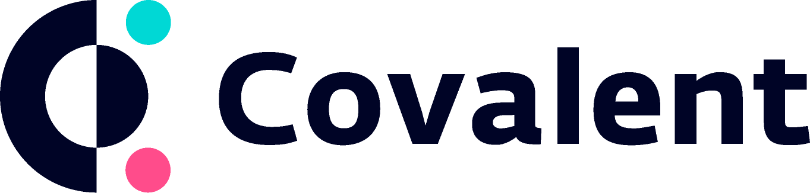
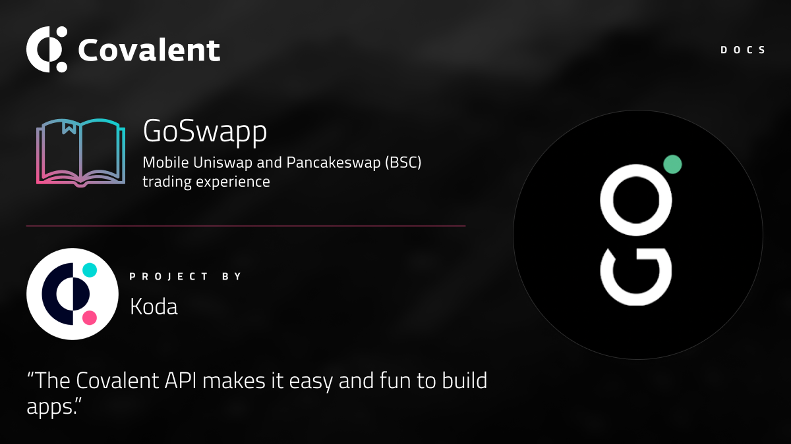

# How to List your Project/dApp
 
 

**Disclaimer:** The content is created andd submitted by the interested project. Covalent only reviews the standards. 

&nbsp;
## Process

Following are the minimum requirements that must met for showcasing at Covalent: 
- Fork/clone the repo to your local machine.
- Introduce your project to us by using the [template](./showcase-template.md).
- When changes are complete, create a PR and submit it here.

&nbsp;
## Getting Started
This guide will help you understand the entire process and getting started.

&nbsp;
### Forking/Cloning the Repo

The main idea is to fork a repository, modify it with your changes, and then submit a PR.

So, as mentioned before, first fork this repository and clone the branch **project-showcase**

```
git clone -b project-showcase https://github.com/covalenthq/covalent-docs.git   
cd covalent-docs
```


&nbsp;
### 1. Choose Category 

Next, choose the category that relates to your project the most. There is a folder per category. If you think we are missing a category, contact us throught any of these channels and we will create a new folder.

[Discord](https://discord.com/invite/fgZPpq69Dd) | [Telegram](https://t.me/CovalentHQ)
&nbsp;
### 2. Copy and Edit Template

The template can be found [here](./showcase-template.md). 

For example, let's say your project is named "project-name", has logo "project-showcase-logo.png" and related to DeFi. Then, you would need to copy this file inside the following folder and change it's name to `project-name.md`. Then you would follow the [template](./showcase-template.md) to create a content and a banner `project-showcase.png`. After that you will put that banner under `images`.


```
covalent-docs
|--docs
|--|--content
|--|--|--project-showase
|--|--|--|--defi/project-name.md
|--|--|--|--dex
|--|--|--|--images/project-showcase.png
|--|--|--|--governance
|--|--|--|--multichain-analysis
|--|--|--|--nft
|--|--|--|--wallet
|--public
|--resources/_gen
|--s
|--static/static/images
...
```

&nbsp;
### 3.  Featuring Project

- After placing your project with appropriate tags in its respective directory go to [index.md](./index.md).
- Select the category which corresponds to the directory you chose to keep your project.
- Follow the following format to feature your project.

```
### [GoSwapp](/project-showcase/goswapp)
[](/project-showcase/goswapp)
```


&nbsp;
### 4.  Submitting PR

When you think you have made all the changes into the template, you can sumbit a pull-request from your forked repo to `developement` branch. 

`Don't create a PR to master!`

We will review it with our standards and voila! You will be on the showcase.

**Note**: Some projects that were accepted before we formed a standard so they might not adhere to all the pre-requisites. If you are sumbmitting a PR after `June 15th, 2021`, you must adhere to standards in the template.


